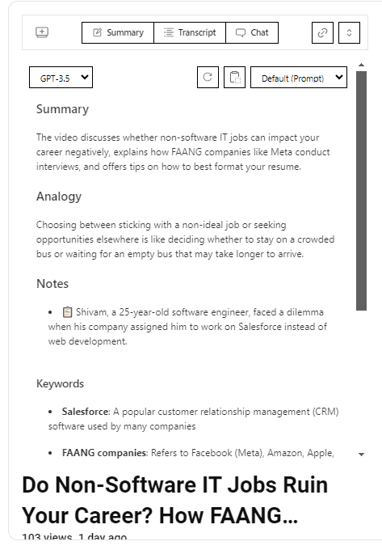
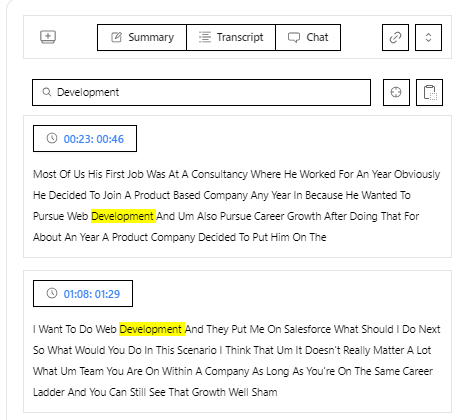
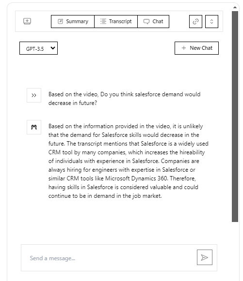

## Youtube GPT ! Chat with videos"

#### AI powered chrome extension that lets you summarize Youtube video into important points for quick understandings, and allow you to do interactive chat with your videos.

First, do the following:

```js
- fill .env file
```

then , run the development server:

```bash
pnpm install
pnpm run dev
```

there will be a build folder generated, follow the steps mentioned:

1.  Go to chrome extension page.
2.  Turn on developer mode.
3.  Click the load unpack button
4.  Navigate to the build folder and select it.
5.  Keep the dev server running while building the extension.

#### Project Snippets





<!--
- Landing page
   -->

- More snippets coming..

#### 3rd-Party Services & Libraries Used

- [Plasmo Framework](https://docs.plasmo.com/)
- [Plasmo Messaging API](https://docs.plasmo.com/framework/messaging#installation)
- React.js
- Shadcn + TailwindCSS
- [OpenAI](https://www.npmjs.com/package/openai)

#### Project Features

- Using the content (main-ui.tsx) to inject our extension UI in youtube video page.
- Extension is capable of making API calls to fetch Youtube's video details (metadata and transcript).
- Extension can summarize the youtube video with the help of the video details by using OpenAI models(3.5 and 4 supported).

#### Project Strategies

- communicating with service worker (background/)
  > Plasmo Framework has a Messaging API that enables the communication between service worker and different parts of your extension easy. We have used the Ports which creates a long-lived connection with the service worker. The port lives inside background directory and can use easily utilized using the usePort hook exported by plasmo.

#### Known issues of the project

#### Reference Images

#### Useful resources

- [Plasmo Documentation](https://docs.plasmo.com)
- [Shdcn Documentation](https://ui.shadcn.com/docs/components-json)

Made by [Noor Muhammad](https://www.linkedin.com/in/connectwithnoor)
